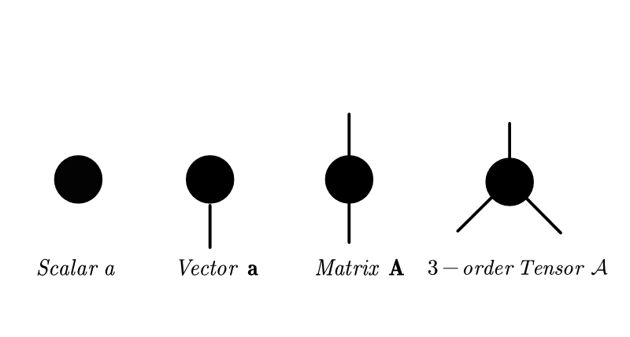
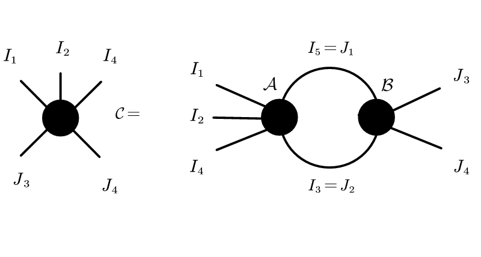
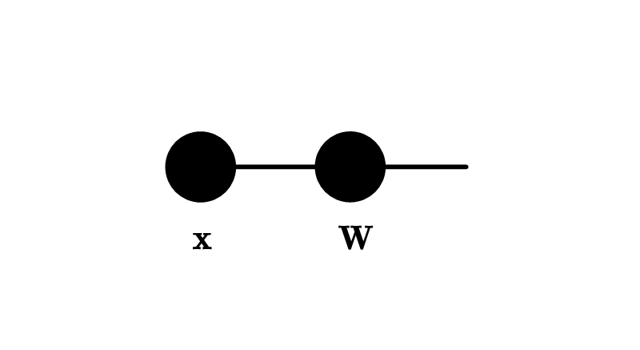
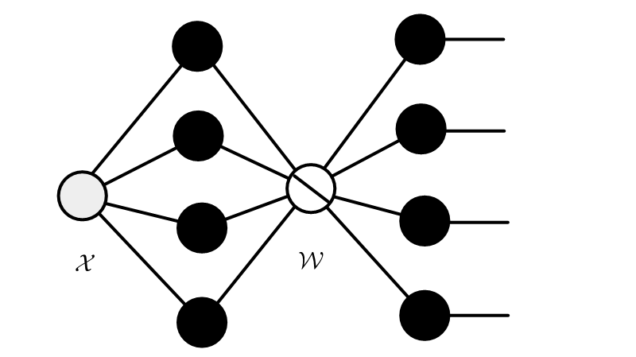
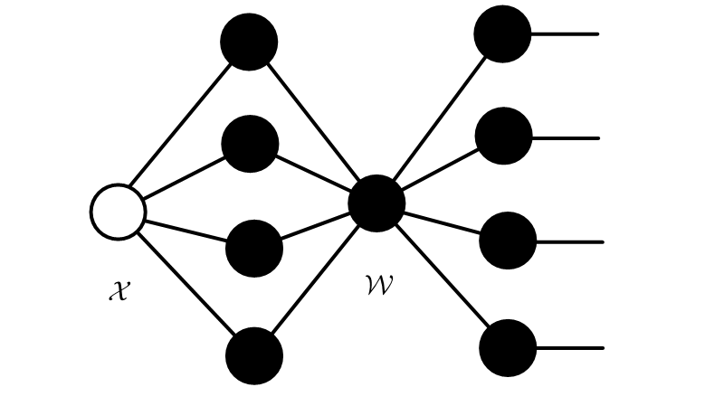
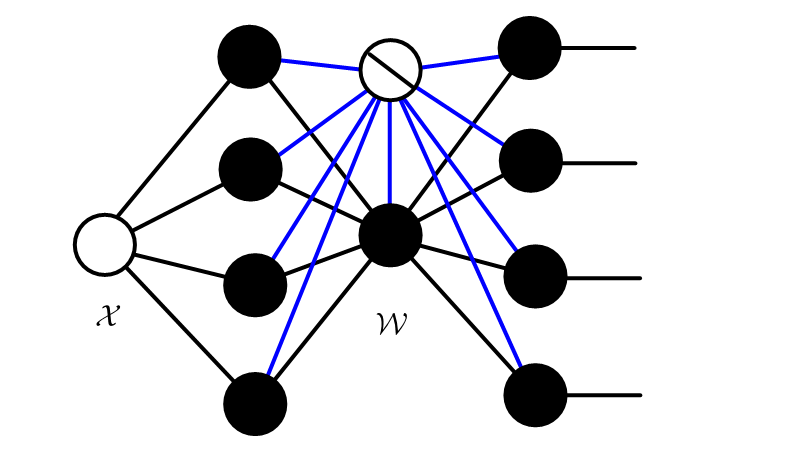
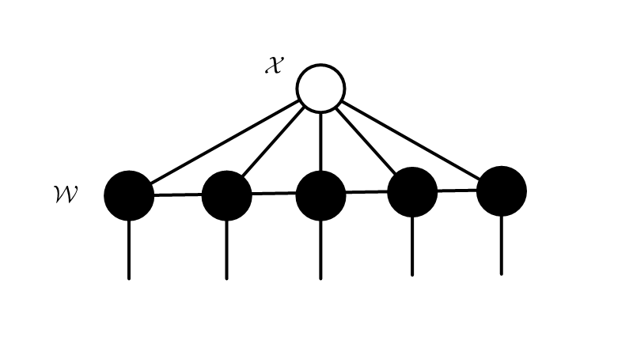
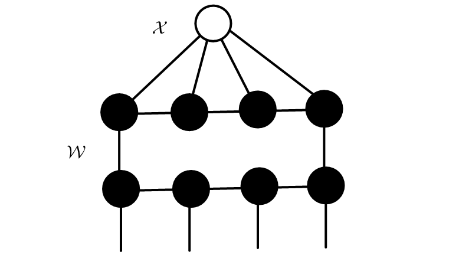

.. tednet documentation master file, created by
   sphinx-quickstart on Fri Dec  4 17:07:01 2020.
   You can adapt this file completely to your liking, but it should at least
   contain the root `toctree` directive.

TedNet: A Pytorch Toolkit for Tensor Decomposition Networks
=============================================================

``tednet`` is a toolkit for tensor decomposition networks. Tensor decomposition networks are neural networks whose layers are decomposed by tensor decomposition, including CANDECOMP/PARAFAC, Tucker2, Tensor Train, Tensor Ring and so on. For a convenience to do research on it, ``tednet`` provides excellent tools to deal with tensorial networks.

.. toctree::
   :hidden:

   Introduction <self>

.. toctree::
   :maxdepth: 3
   :caption: Getting Start

   installation
   quick_start
   api
   contact

.. toctree::
    :maxdepth: 1
    :caption: Tutorials

    tutorials/tr_cnn
    tutorials/tr_rnn

Tensors
>>>>>>>>>>>>>>
Tensors, also known as multi-way arrays, can be viewed as a higher-order extension of vectors (i.e., an 1st-order tensors) and a matrices (i.e., an 2nd-order tensors).  Like rows and columns in a matrix, an Nth-order tensor :math:`{\mathcal X}\in\mathbb R^{I_1\times I_2 \ldots\times I_N}` has N-modes (or ways, orders, indices) whose lengths (or dimensions) are represented by :math:`I_1, \ldots, I_N` respectively. Tensors can be graphically represented in diagrams which is known as Tensor Networks. As following illustration, a black node denotes a tensor and a edge connected to the node means a tensor mode.

Tensor Contraction
>>>>>>>>>>>>>>>>>>>>>>

Tensor contraction is the most typical operation for tensors, contracting two tensors into one tensor along the associated pairs of indices. As a result, the corresponding connected edges disappear while the dangling edges persist. The Tensor Network representation of such operation can be illustrated as:

As show in above figure, contraction between a 5th-order tensor :math:`{\mathcal A}` and a 4th-order tensor :math:`{\mathcal B}` along the index pairs :math:`(i_5,j_1)` and :math:`(i_3,j_2)` yields a 5th-order tensor :math:`{\mathcal C}`, with entries

:math:`{\mathcal C}_{i_1,i_2,i_4,j_3,j_4}=\sum_{i_3,i_5} {\mathcal A}_{i_1,i_2,i_3,i_4,i_5} {\mathcal B}_{i_5,i_3,j_3,j_4}`.

Tensor contractions among multiple tensors can be computed by performing tensor contraction between two tensors many times. Hence, the order (or number of modes) of an entire Tensor Network is given by the number of dangling edges which are not contracted. 

Tensor decomposition is a common technique for compressing Neural Networks, by decomposing a higher-order tensor into several lower-order tensors (usually matrices or 3rd-order tensors) that are sparsely interconnected through the tensor contraction operator. The basic tensor decomposition include CANDECOMP/PARAFAC (CP), Tucker, Block Term (BT), Tensor Train (TT) and so on. And such decomposition formats can be illustrated as the corresponding Tensor Network diagrams.

Tensorized FC Layers 
>>>>>>>>>>>>>>>>>>>>>>
By replacing Fully-Connected (FC) layers or Convolution Layers with tensorized layers, large amount of parameters can be reduced.  For example, a FC layer is formulated as :math:`{y}= {W}{x}` and can be illustrated as

By a simple reshaping method, we can reformulate the FC layer as

:math:`{\mathcal{Y}}_{j_1,\ldots,j_M}= \sum_{i_1,\ldots,i_N=1}^{I_1,\ldots,I_N}{\mathcal W}_{i_1,\ldots,i_N,j_1,\ldots,j_M} ~x_{i_1,i_2,\ldots,i_N}`.

According to the differences of the tensor decomposition ways, there are different tensor formats to represent FC Layers. The most popular tensor decomposition format included CP, Tucker,  Block-Term Tucker, Tensor Train and Tensor Ring. 

CP Layers 
>>>>>>>>>>>>>>

The CP decomposition (also called CANDECOMP/PARAFAC decomposition) factorizes a higher-order tensor into a sum of several rank-1 tensor components. The mathematical neural network layer format of utilizing CP decomposition is

:math:`{\mathcal{Y}}_{j_1,\ldots,j_M}= \sum_{i_1,\ldots,i_N=1}^{I_1,\ldots,I_N}\sum_{r=1}^Rg_{r} a^{(1)}_{i_1,r}\ldots a^{(N)}_{i_N,r}a^{(N+1)}_{j_1,r}\ldots a^{(N+M)}_{j_M,r} x_{i_1,i_2,\ldots,i_N}`.

When calculating the CP decomposition, the first issue arises is how to determine the number of rank-1 tensor components, i.e., CP-rank :math:`R`. Actually, it's an NP-hard problem. In practice, an numerical value is usually assumed in advance, i.e., as a hyperparameter, to fit various CP-based models

Tucker Layers 
>>>>>>>>>>>>>>

Tucker decomposition factorizes a higher-order tensor into a core tensor multiplied by a corresponding factor matrix along each mode. To be more specific,  the mathematical neural network layer format of utilizing tucker decomposition is

:math:`{\mathcal{Y}}_{j_1,\ldots,j_M}= \sum_{i_1,\ldots,i_N=1}^{I_1,\ldots,I_N}\sum_{r_1=1}^{R_1}\sum_{r_2=1}^{R_2}\cdots\sum_{r_N=1}^{R_N}g_{r_1,r_2,\ldots,r_N} a^{(1)}_{i_1,r}\ldots a^{(N)}_{i_N,r}a^{(N+1)}_{j_1,r}\ldots a^{(N+M)}_{j_M,r} x_{i_1,i_2,\ldots,i_N}`.

Here, please note that compared with the CP-rank, :math:`R_1, R_2, \ldots, R_N` could take different numerical values.

Block-Term Tucker Layers 
>>>>>>>>>>>>>>>>>>>>>>>>>>>>

Recently, a more generalized decomposition method called Block Term (BT) decomposition, which generalizes CP and Tucker via imposing a block diagonal constraint on the core tensor, has been proposed to make a trade-off between them. The BT decomposition aims to decompose a tensor into a sum of several Tucker decompositions with low Tucker-ranks.  The mathematical neural network layer format is

:math:`{\mathcal{Y}}_{j_1,\ldots,j_M}= \sum_{i_1,\ldots,i_N=1}^{I_1,\ldots,I_N}\sum_{c}^{C}\sum_{r_1,\ldots,r_N=1}^{R_1,\ldots,R_N}g_{r_1,\ldots,r_N} a^{(1)}_{i_1,c,r_1}\ldots a^{(N)}_{i_N,c,r_N}a^{(N+1)}_{j_1,c,r_{N+1}}\ldots a^{(N+M)}_{j_M,c,r_{N+M}} x_{i_1,i_2,\ldots,i_N}`.

:math:`R_T` denotes the Tucker-rank (which means the Tucker-rank equals :math:`\{R_1, ..., R_N\}`) and :math:`C` represents the CP-rank. They are together called BT-ranks.

Tensor Train (Matrix Product Operator) Layers 
>>>>>>>>>>>>>>>>>>>>>>>>>>>>>>>>>>>>>>>>>>>>>>>>>>>>>>>>

Matrix Tensor train (mTT) decomposition(sometimes also called Tensor Train), also called Matrxi Product Operator(MPO) in quantum physics, factorizes a higher-order tensor into a linear multiplication of a series of 4th-order core tensors.  The mathematical neural network layer format is

:math:`{\mathcal{Y}}_{j_1,\ldots,j_N}= \sum_{i_1,\ldots,i_N=1}^{I_1,\ldots,I_N}\sum_{r_{1},\ldots,r_{N}=1}^{R_1,\ldots,R_{N}} g^{(1)}_{i_1,j_1,r_1} g^{(2)}_{r_1,i_2,j_2,r_2}\cdots g^{(N)}_{r_{N},i_N,j_N} x_{i_1,i_2,\ldots,i_N}`.

:math:`\{R_1,R_2,\ldots,R_{N-1}\}` denote the TT-ranks.

Tensor Ring (Matrix Product State)  Layers 
>>>>>>>>>>>>>>>>>>>>>>>>>>>>>>>>>>>>>>>>>>>>>>>>>>>>>>>>

Tensor Train benefits from fast convergence, however, it suffers from the two endpoints, which hinders the representation ability and the flexibility of the TT-based models. Thus, to release the power of the linear architecture, researchers link the endpoints to constitute a ring format named Tensor Ring(TR).  The mathematical neural network layer format is

:math:`{\mathcal{Y}}_{j_1,\ldots,j_M}= \sum_{i_1,\ldots,i_{N+M}~~=1}^{I_1,\ldots,I_{N+M}}\sum_{r_{0},\ldots,r_{N+M-1}~~~=1}^{R_0,\ldots,R_{N+M-1}} g^{(1)}_{r_0,i_1,r_1} \cdots g^{(N+1)}_{r_{N},j_1, r_{N+1}} \cdots g^{(N+M)}_{r_{N+M-1}~~,j_M, r_{0}} x_{i_1,i_2,\ldots,i_N}`.

where :math:`\{R_0,R_1,\ldots,R_{N}\}` denote the TR-ranks, each node s an 3rd-order tensor and :math:`R_0=R_N`.  Compared with Tensor Train, it is not necessary for TR to follow a strict order when multiplying its nodes.

Combination of Tensor Decomposition and Deep Networks
>>>>>>>>>>>>>>>>>>>>>>>>>>>>>>>>>>>>>>>>>>>>>>>>>>>>>>>>

These tensor Layer formats can be directlty adopted by simple Neural Networks and RNNs to replace the huge FC layers.

For the convolution layers, we can also generalize this idea. We can also represent the convolution weights into tensor decomposition format. For example, the convolution weight is:

:math:`\mathcal{W}\in R^{H \times W \times C_{in} \times C_{out}}`

the CP format is:

:math:`\mathcal{W}_{h,w,c_{in},c_{out}} = \sum_{r=1}^Rg_{r} a^{(1)}_{h,~r}a^{(2)}_{w,~r}a^{(3)}_{c_{in},~r}a^{(4)}_{c_{out},~r}`

if we generalize the two channel dimentions, the weight can be represented as:

:math:`\mathcal{W}_{h,w,c_{in(1)}~\cdots c_{in(N)}~~,~c_{out(1)}~\cdots c_{out(M)}} = \sum_{r=1}^Rg_{r} a^{(1)}_{h,~r}a^{(2)}_{w,~r}
a^{(3)}_{c_{in(1)}~~,~r}\cdots a^{(2+n)}_{c_{in(n)}~~,~r}a^{(3+N)}_{c_{out(1)}~~,~r}\cdots a^{(2+N+M)}_{c_{out(M)}~~,~r}`

We can also represent the weight in other tensor formats.
